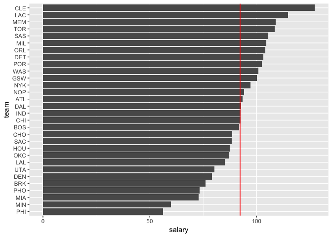
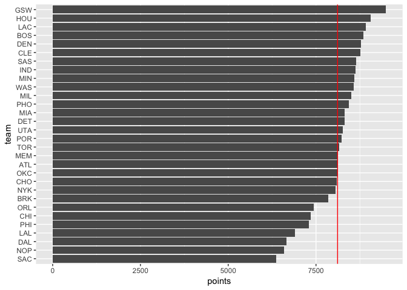
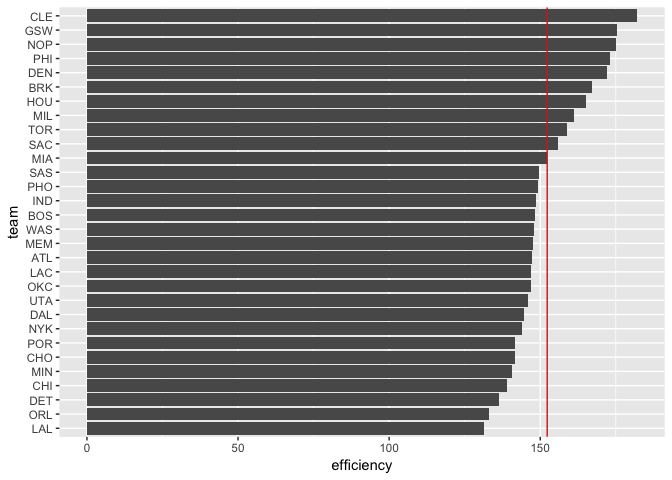
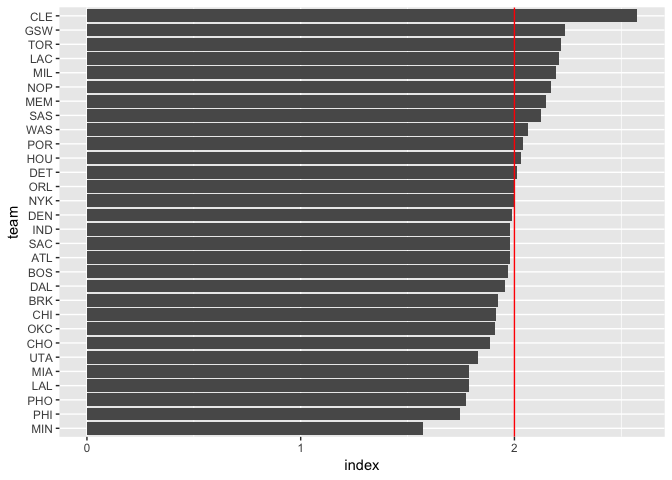

workout01
================

Rankings of Teams
-----------------

``` r
#input the nba2018-teams.csv file into the Rmd file, and pull up ggplot and dplyr
library(tidyverse)
```

    ## ── Attaching packages ──────────────────────────────── tidyverse 1.2.1 ──

    ## ✔ ggplot2 3.0.0     ✔ purrr   0.2.5
    ## ✔ tibble  1.4.2     ✔ dplyr   0.7.6
    ## ✔ tidyr   0.8.1     ✔ stringr 1.3.1
    ## ✔ readr   1.1.1     ✔ forcats 0.3.0

    ## ── Conflicts ─────────────────────────────────── tidyverse_conflicts() ──
    ## ✖ dplyr::filter() masks stats::filter()
    ## ✖ dplyr::lag()    masks stats::lag()

``` r
teams <- read_csv('~/Desktop/stat133/workout/workout1/data/nba2018-teams.csv')
```

    ## Parsed with column specification:
    ## cols(
    ##   team = col_character(),
    ##   experience = col_integer(),
    ##   salary = col_double(),
    ##   points3 = col_integer(),
    ##   points2 = col_integer(),
    ##   points1 = col_integer(),
    ##   points = col_integer(),
    ##   off_rebounds = col_integer(),
    ##   def_rebounds = col_integer(),
    ##   assists = col_integer(),
    ##   steals = col_integer(),
    ##   blocks = col_integer(),
    ##   turnovers = col_integer(),
    ##   fouls = col_integer(),
    ##   efficiency = col_double()
    ## )

### Basic Rankings

``` r
#graph teams on horizontal bar chart ranked by total salary, with an average team salary line
ggplot(teams, aes(x = reorder(team, salary), y = salary)) +
  labs(x = 'team') +
  geom_bar(stat = 'identity') +
  coord_flip() +
  geom_hline(aes(yintercept = mean(salary)), color = "Red")
```



``` r
#graph teams on horizontal bar chart ranked by total points, with an average team points line
ggplot(teams, aes(x = reorder(team, points), y = points)) +
  labs(x = 'team') +
  geom_bar(stat = 'identity') +
  coord_flip() +
  geom_hline(aes(yintercept = mean(points)), color = "Red")
```



``` r
#graph teams on horizontal bar chart ranked by efficiency, with an average team efficiency line
ggplot(teams, aes(x = reorder(team, efficiency), y = efficiency)) +
  labs(x = 'team') +
  geom_bar(stat = 'identity') +
  coord_flip() +
  geom_hline(aes(yintercept = mean(efficiency)), color = "Red")
```



### Rationale behind my index

-   create index which is (salary divided by average salary) + (efficiency divied by average efficiency)
-   this index shows how teams compare to the average in both salary and efficiency
-   salary and efficiency are both key, because they show what a team can afford as far as players, and efficiency sums up all of the in game statistics that show how well teams perform
-   the reason I take the average is to make so both salary and efficiency are scaled evenly
-   by doing this, the average will be exactly centered at 2

### Graph with My Index

``` r
#add my index to teams
teams <- mutate(teams, index = (salary / mean(salary)) + (efficiency / mean(efficiency)))

#graph teams on horizontal bar chart ranked by my index, with an average of these indexes drawn vertically
ggplot(teams, aes(x = reorder(team, index), y = index)) +
  labs(x = 'team') +
  geom_bar(stat = 'identity') +
  coord_flip() +
  geom_hline(aes(yintercept = mean(index)), color = "Red")
```



### Comments and Reflections

-   This was my first time doing something like this, and I thought it was a cool project, but I got stuck on parts and that was quite frustrating
-   It was also my first time using relative paths, and I found them to be extremely helpful
-   It was my first time using R script, which I found to be pretty straightforward
-   The hardest thing for me was figuring out how to break the data from nba2018.csv into teams, even though we did similar things in lab
-   I thought everything we hadn't explicitly done in lab/hw was pretty self-explanatory
-   A classmate helped me understand the best way to compile the data
-   It took me around 7 hours to finish this project, considering I got stuck quite a few times and had to work through some problems
-   Figuring out how to make nba2018-teams.csv was the most time consuming part of this project for me
-   I thought the last question was the most interesting, as it made us think critically about what is the best way to rank teams as a whole
